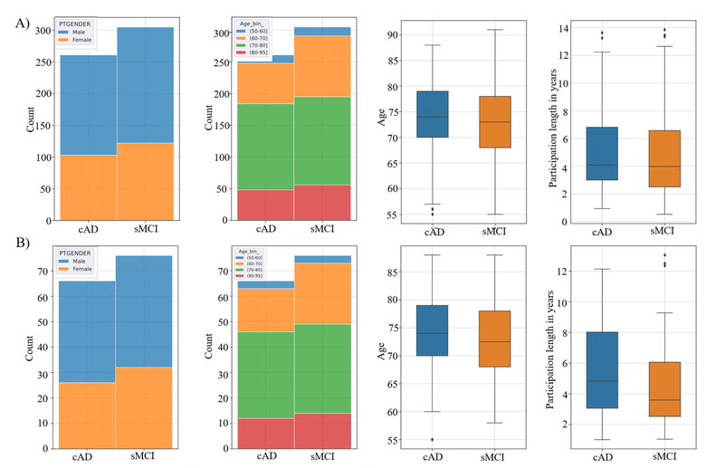
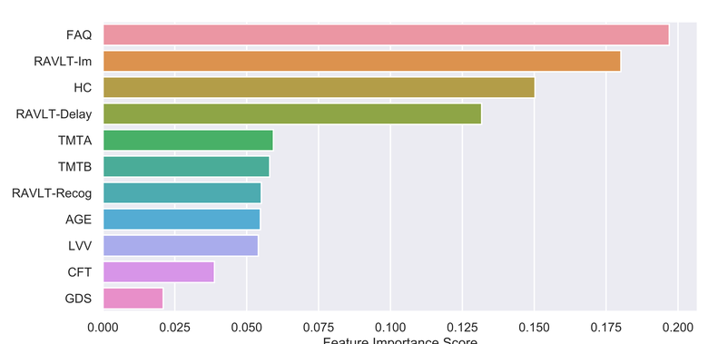
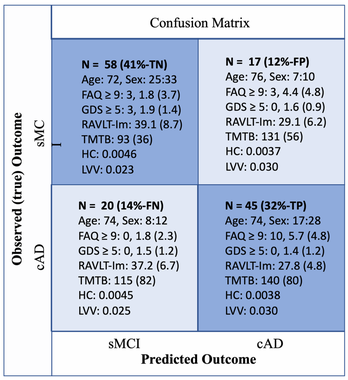

# MCI-to-AD-Conversion-Predictors

This repository contains code and analysis related to the research paper "Functional activity level reported by an informant is an early predictor of Alzheimer's disease" (Vik et al., 2023).

Source code to the reasearch paper is available here: [Vik_et_al_FAQ-predictor-of-AD_paper-source-code](https://github.com/marekkoc/Vik_et_al_FAQ-predictor-of-AD_paper-source-code/blob/main/faq-predictor-of-ad.ipynb) (private [MMIV repo](https://github.com/MMIV-ML/MCI-subgroups/blob/master/src/3.31-data2-RF-bl-FAQ-without-gender.ipynb)).

## Summary

The study investigates whether subtle changes in daily life functioning reported by close informants can predict conversion from Mild Cognitive Impairment (MCI) to Alzheimer's Disease (AD). Using longitudinal data from the Alzheimer's Disease Neuroimaging Initiative (ADNI), the researchers identified 360 patients with stable MCI (sMCI) and 320 who converted to AD (cAD).

A Random Forest (RF) classification model was developed using 11 features including:
- Functional Activity Questionnaire (FAQ) responses from informants
- Verbal memory test scores (RAVLT immediate recall, delayed recall, and recognition)
- Executive function measures (Trail Making Test parts A and B, Category Fluency Test)
- Brain volume measurements (hippocampal volume and lateral ventricle volumes from MRI)
- Age and Geriatric Depression Scale (GDS) scores

## Methods

The dataset was split into training (79%, n=540) and test (21%, n=140) sets. To ensure representativeness and prevent bias, both datasets were carefully balanced by stratifying with respect to:
- Age bins
- Gender distribution
- Class belonging (sMCI vs. cAD)
- Length of participation in the study
 
<table align="center">
  <tr><td></td></tr>
  <tr><td align="center"><i>Train-Test Balance. Controlling for gender, age bins, age and length of participation in years in the train (A) and test (B) set</i></td></tr>
</table>
 

This balanced data approach ensured that demographic characteristics and participation duration were similarly distributed across both the training and test sets, enhancing the reliability of the model's performance evaluation.

A Random Forest algorithm was implemented with optimized hyperparameters through 10-fold cross-validation. Multiple interpretability approaches were applied to understand feature importance:
- Gini importance from the Random Forest model
- Permutation importance
- Drop-feature importance
- SHapley Additive exPlanations (SHAP) values
- Partial dependency plots (PDP) and individual composition expectation (ICE) plots

 
<table align="center">
  <tr><td></td></tr>
  <tr><td align="center"><i>Feature Importance. Bar graph displaying the relative order of the eleven features (y-axis) when classifying sMCI versus cAD by the RF model evaluated on the hold-out validation set. The importance is estimated as gini importance. The x-axis shows the relative importance score. RAVLT: Rey Auditory Verbal Learning Test, TMT: Trail Making Test part A and B, CFT: Category Fluency Test; LVV: lateral ventricle volumes, GDS: Geriatric Depression Scale, FAQ: Functional Activity Questioner</i></td></tr>
</table>
 

## Key Findings

The model achieved approximately 70% accuracy in predicting conversion from MCI to AD in the test set, with 69% sensitivity and 77% specificity. Multiple model interpretation techniques consistently identified three key predictors:
1. Daily life functioning (FAQ scores)
2. Verbal memory function (particularly RAVLT immediate and delayed recall)
3. Hippocampal volume

 
<table align="center">
  <tr><td></td></tr>
  <tr><td align="center"><i>Confusion Matrix. The 2 × 2 confusion matrix computed for the sMCI and cAD labels returned from applying the trained nonlinear RF model prediction on the test set compared with the co-occurrences of the true (observed) sMCI/cAD (longitudinal defined diagnose) labels. The diagonal cells represent correctly classified subjects (the number of occurrences in each cell is given as N, TN: true negative, TP: true positive, FP: false positive, FN: false negative), and these cells are shaded in blue. Off-diagonal cells represent various events of misclassification. Observed predicted co-occurrences are also accompanied, for each cell, with corresponding information about sex ratio (F/M), mean(SD) in; FAQ: Functional Activity Questioner, GDS: Geriatric Depression Scale, RAVLT-Im: Rey Auditory Verbal Learning Test immediate recall, TMTB: Trail Making Test part B, HC: hippocampus volume, LVV: lateral ventricle volume</i></td></tr>
</table>
 

Post-hoc analyses revealed that even subtle changes in everyday functioning (FAQ scores as low as 1-2) significantly increased the risk of conversion to AD. Individuals scoring ≥1.5 on the FAQ showed a distinctly different pattern than those scoring <1.5, suggesting a meaningful threshold far lower than the traditional cutoff of 9.

The results demonstrate that informant reports about functional changes should be given weight during clinical evaluations of MCI patients, even when changes appear minimal. This research provides insights for developing personalized prognostic tools within a multi-factorial clinical framework.

## Clinical Implications

The findings highlight the importance of including functional activity assessments in longitudinal studies investigating pathways from normal cognitive aging to AD and other neurodegenerative disorders. While the prediction accuracy (70%) is not yet sufficient for direct clinical implementation, the results suggest that incorporating FAQ assessments in clinical evaluations could enhance early risk assessment for AD conversion.

## Publications

1.Personalized prognosis & treatment using Ledley-Jaynes machines: An example study on conversion
from Mild Cognitive Impairment to Alzheimer’s Disease, P.G.L. Porta Mana, I. Rye, A. Vik, M. Kociński,
A. Lundervold, A. J. Lundervold, A. S. Lundervold: Open Science Framework, 2023,
([link](https://osf.io/preprints/osf/8nr56_v1)).

2.Functional activity level reported by an informant is an early predictor of Alzheimer’s disease, A. Vik,
M. Kociński, I. Rye, A. J. Lundervold, A. S. Lundervold, BMC Geriatr 23, 205, 2023,
([link](https://doi.org/10.1186/s12877-023-03849-7)).

3.Predicting conversion to Alzheimer’s disease in individuals with Mild Cognitive Impairment using
clinically transferable features. I. Rye, A. Vik, M. Kocinski, A.S. Lundervodld, A.J. Lundervold, Sci Rep
12, 15566, 2022, ([link](https://doi.org/10.1038/s41598-022-18805-5)).
